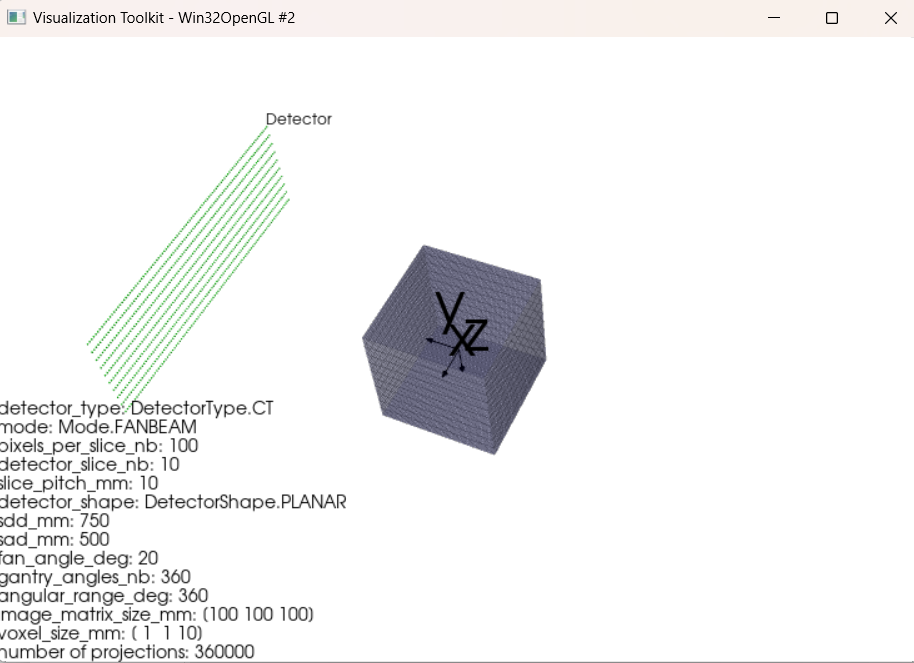
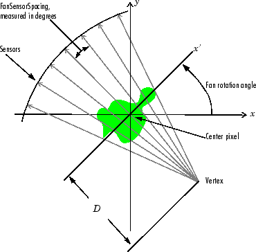

## O repozytorium

Repozytorium wprowadza do rekonstrukcji obrazu z projekcji z zastosowaniem wiązki równoległej promieniowania. Kod został opracowany w oparciu o framework DAPHNE. Repozytorium jest częścią wpisu na blogu: https://medycznie-w-it.blogspot.com/2023/03/rekonstrukcja-wiazka-wachlarzowa-z.html 

  

 
 

Framework DAPHNE przybliża do stworzenia prawdziwego tomografu:

  

 
 

Projekt jest oparty o wiązkę wachlarzową. 

  

 
 

## Bibliografia
[1]. Rodet, T. & Grangeat, Pierre & Desbat, Laurent. (2002). Multichannel algorithm for fast 3D reconstruction. Physics in medicine and biology. 47. 2659-71. 10.1088/0031-9155/47/15/308. 
[2]. Panetta D, Camarlinghi N. 3D Image Reconstruction for CT and PET : A Practical Guide with Python. CRC Press; 2020
